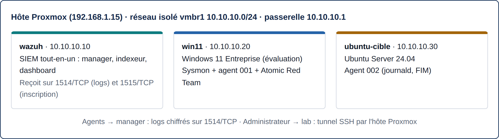

# Mini-SOC maison

Un SOC de poche monté sur mon home lab : un SIEM **Wazuh** collecte les logs d'un poste **Windows 11** (avec **Sysmon**) et d'un serveur **Ubuntu**. J'y rejoue des comportements d'attaquant avec **Atomic Red Team**, rattachés à **MITRE ATT&CK**, pour vérifier ce que le SIEM voit vraiment. Quand il manque quelque chose, je corrige (règle de détection ou collecte de logs) et je rejoue le test.

    

| Document | Contenu |
|---|---|
| [Rapport complet (PDF)](rapport/rapport-mini-soc-eisvogel.pdf) | Contexte, méthodologie, résultats, leçons, annexes |
| [Résultats test par test](detections/README.md) | Chaque attaque avec ses captures et son verdict |
| [Règle de détection](rules/local_rules.xml) | Règle Wazuh personnalisée 100100 (T1053.005) |



## Résultats

| # | Technique MITRE | Tactique | Résultat |
|---|---|---|---|
| 1 | T1136.001 Création d'un compte local | Persistence | Détecté nativement (niveau 12) |
| 2 | T1053.005 Tâche planifiée | Persistence, Execution | Mal qualifié (niveau 3), corrigé par la **règle 100100** (niveau 10) |
| 3 | T1547.001 Clé de registre Run | Persistence, Privilege Escalation | Détecté nativement (niveau 6) |
| 4 | T1003.001 Mémoire de LSASS | Credential Access | Bloqué par Defender mais invisible au SIEM, corrigé en **collectant le canal Defender** |
| 5 | T1070.001 Effacement des journaux | Defense Evasion | Détecté (événement 1102) |
| L1 | T1110 Force brute SSH | Credential Access | Détecté nativement sur Linux |
| L2 | Création de compte vue par le FIM | Persistence | Détecté par le contrôle d'intégrité de `/etc` |

**7/7 comportements visibles dans le SIEM après corrections, 2 trous de détection trouvés et corrigés.**

## Le lab

| Machine | Adresse | Rôle |
|---|---|---|
| wazuh | 10.10.10.10 | Wazuh 4.14 tout-en-un (manager, indexeur, dashboard) |
| win11 | 10.10.10.20 | Windows 11, Sysmon (config SwiftOnSecurity), agent Wazuh, Atomic Red Team |
| ubuntu-cible | 10.10.10.30 | Ubuntu Server 24.04, agent Wazuh (journald, FIM) |

Les trois VM tournent sous **Proxmox**, sur un réseau virtuel isolé (10.10.10.0/24) en NAT, séparé du réseau de la maison. L'administration passe par un tunnel SSH via l'hôte Proxmox.

## Ce que j'en retiens

- Mesurer d'abord la détection native, puis ne compléter que là où il y a un trou.
- Deux types de trous : une détection qui existe mais au mauvais niveau, et une source de logs qui n'est pas collectée.
- Une recherche vide ne prouve rien : casse, filtres actifs et indexation des seules alertes peuvent cacher un événement bien réel.

## Suite prévue

- Suricata sur un Raspberry Pi 5 pour la détection réseau, alertes envoyées à Wazuh.
- Pare-feu OPNsense et VLAN pour segmenter le lab.
- Automatisation du lab avec Terraform et Ansible.

## Arborescence

```
.
├── README.md              ce fichier
├── detections/README.md   résultats détaillés, test par test, avec captures
├── rules/local_rules.xml  règle Wazuh personnalisée (100100)
├── images/                captures d'écran utilisées par les rapports
└── rapport/               rapport PDF et ses sources
    ├── rapport-mini-soc-eisvogel.pdf   version Pandoc / LaTeX (Eisvogel)
    ├── rapport-mini-soc.md             source de cette version
    ├── rapport-mini-soc.pdf            version HTML / CSS
    └── build.py, build-eisvogel.sh     scripts de génération
```

Toutes les machines testées m'appartiennent et sont isolées. Aucun identifiant réel n'apparaît dans ce dépôt.
