# Tests d'attaque et détections

Environnement : VM Windows 11 `win11` (10.10.10.20, Sysmon avec la config SwiftOnSecurity + agent Wazuh 001) et VM Ubuntu 24.04 `ubuntu-cible` (10.10.10.30, agent Wazuh 002). Le manager Wazuh 4.14 tourne sur 10.10.10.10. Les attaques Windows sont lancées avec Invoke-AtomicRedTeam.

## Synthèse

| # | Technique MITRE | Tactique | Résultat |
|---|---|---|---|
| 1 | T1136.001 Create Account: Local Account | Persistence | Détecté nativement (niveau 12) |
| 2 | T1053.005 Scheduled Task | Persistence / Execution | Mal qualifié (niveau 3). Corrigé avec la **règle perso 100100** (niveau 10) |
| 3 | T1547.001 Registry Run Keys | Persistence, Privilege Escalation | Détecté nativement et bien qualifié (niveau 6) |
| 4 | T1003.001 LSASS Memory | Credential Access | Bloqué par Defender mais **invisible pour le SIEM**. Corrigé en collectant le canal Defender |
| 5 | T1070.001 Clear Windows Event Logs | Defense Evasion | Détecté (événement 1102) ; les logs étaient déjà centralisés |
| L1 | T1110 Brute Force (SSH) | Credential Access | Détecté nativement sur Linux |
| L2 | Création de compte vue par le FIM | Persistence | Détecté par le contrôle d'intégrité de `/etc` en temps réel |

---

## Mise en place côté Windows

La VM Windows est sur le réseau isolé du lab : on n'y accède pas directement depuis le PC. On passe par un tunnel SSH via l'hôte Proxmox (`ssh -L 13389:10.10.10.20:3389 pve`), puis le client Bureau à distance se connecte à `localhost:13389`.

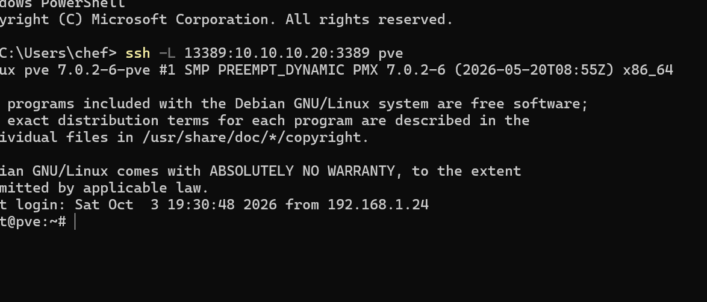

L'agent `win11` est actif et remonte ses logs au manager.

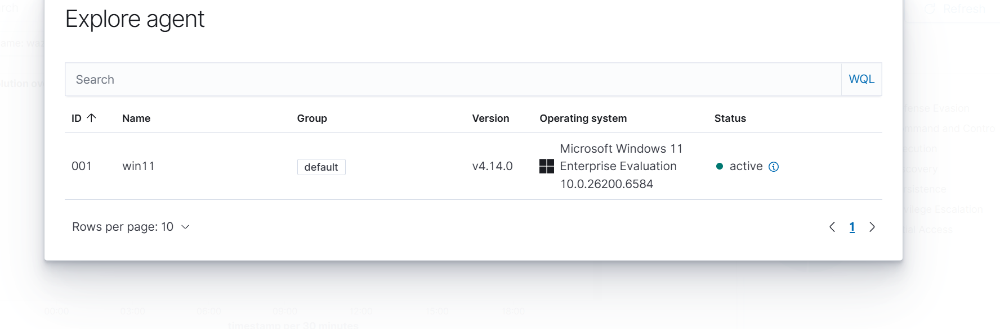

Sans aucune configuration, l'agent fait aussi un audit **SCA** contre le benchmark CIS Windows 11 (score de départ : 26 %) et de la **détection de vulnérabilités** sur les logiciels installés.

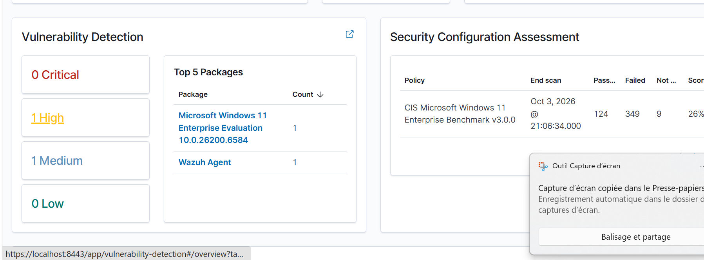

Premier exemple de bruit : à chaque ouverture, PowerShell crée un fichier `__PSScriptPolicyTest_*` dans Temp (Sysmon event 11). C'est un comportement bénin, candidat à une exclusion.

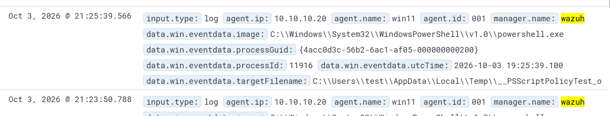

Vue d'ensemble en fin de session : les alertes sont classées par sévérité selon le niveau de la règle (0-6 faible, 7-11 moyen, 12-14 haut, 15+ critique), et les tactiques MITRE vues sur `win11` apparaissent dans le panneau de l'agent.

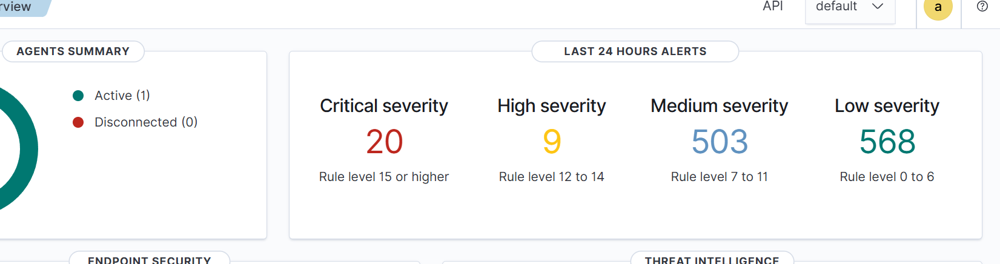
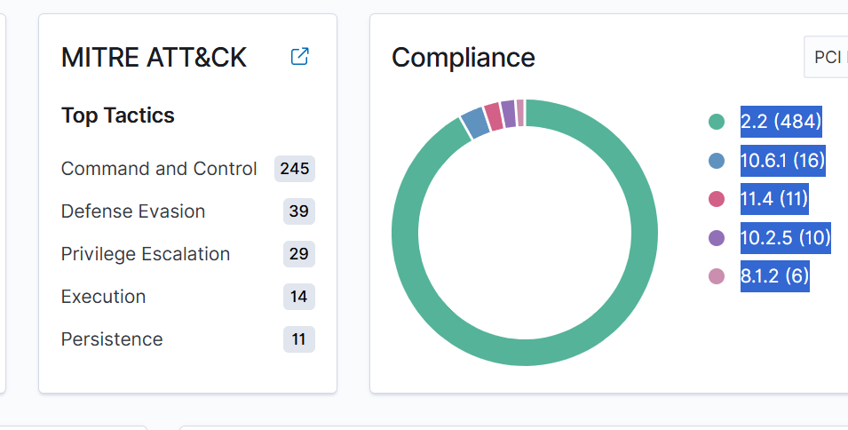

---

## 1. T1136.001 : création d'un compte administrateur local

**Test** : Atomic `T1136.001-8`, qui lance `net user /add` puis `net localgroup administrators /add`. Côté attaquant, on liste d'abord les variantes disponibles (`-ShowDetailsBrief`) puis on lance la n°8 :

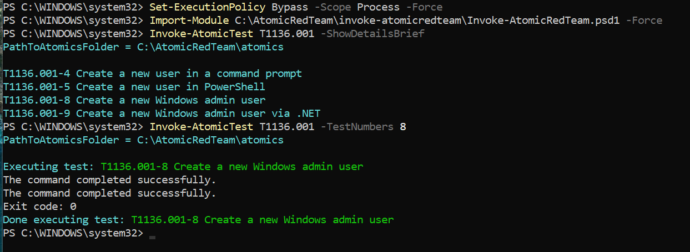

On vérifie sur le poste que le compte `T1136.001_Admin` existe bien (avant de le supprimer avec `-Cleanup`) :

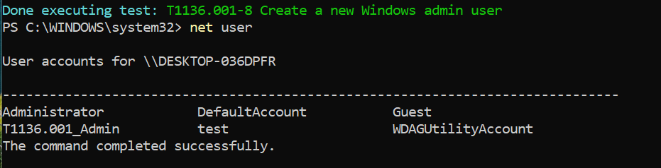

**Ce que les logs voient** :

- journal Security : événements 4720 (compte créé) et 4732 (ajout au groupe Administrateurs) ;
- Sysmon : event 1, `net.exe` lancé par `cmd.exe`.

**Alertes Wazuh** : 3 alertes, dont une de niveau ≥ 12 (« Administrators Group Changed »). Elles sont rattachées à PCI DSS 10.2.5 et 8.1.2.

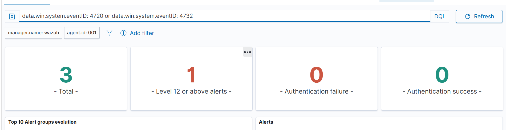
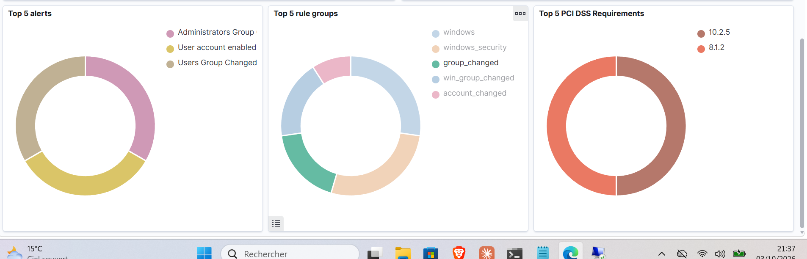

La commande elle-même est vue par Sysmon (« net.exe binary was started by a Windows cmd shell », groupe `sysmon_eid1_detections`) :

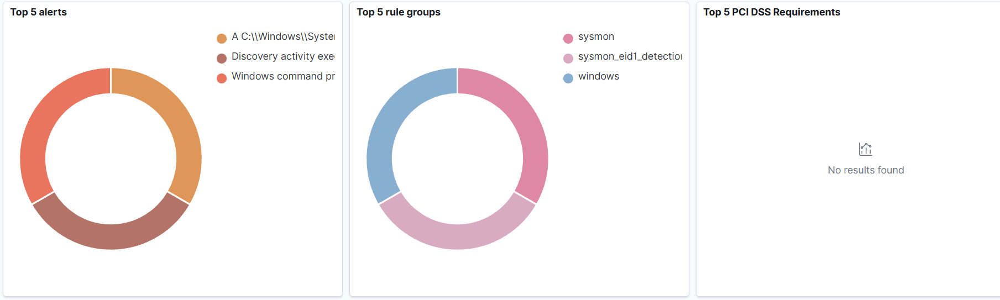

**Verdict** : détecté nativement, avec deux sources complémentaires. Le journal Security voit le **résultat** (compte, groupe), Sysmon voit la **commande**.

---

## 2. T1053.005 : tâche planifiée (règle personnalisée)

**Test** : Atomic `T1053.005-2`, qui lance `SCHTASKS /Create /SC ONCE /TN spawn /TR cmd.exe`. La tâche « spawn » est bien créée :

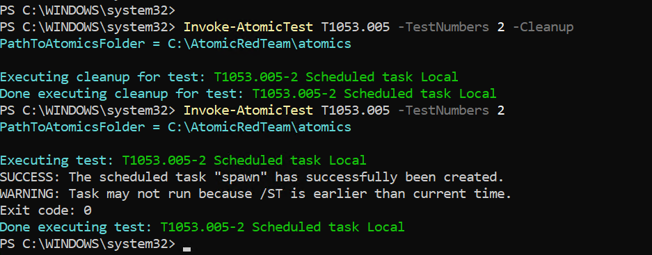

**Ce que Sysmon voit** (vérifié dans la VM avec `Get-WinEvent`) : event 1 `schtasks.exe`, avec la ligne de commande complète, le parent `cmd.exe`, le niveau d'intégrité High et les hashes.

**Piège rencontré** : la recherche `commandLine: *schtasks*` ne donnait rien, parce que la commande était en MAJUSCULES et que la recherche joker est sensible à la casse. Une recherche vide ne prouve pas l'absence d'un événement.

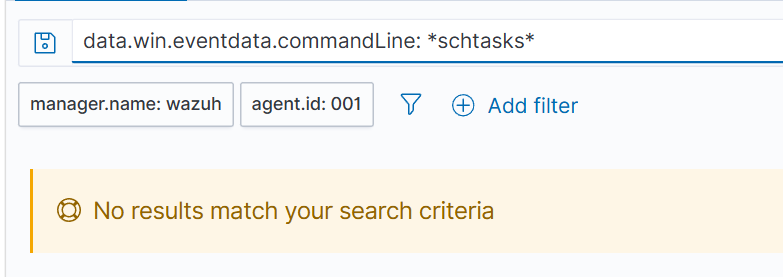

**Avant** : en cherchant sur `image: *schtasks.exe`, on ne trouve qu'une alerte générique, la règle 92032 « Suspicious Windows cmd shell execution », de **niveau 3**. Elle est noyée dans le bruit, et rien n'y indique une persistance.

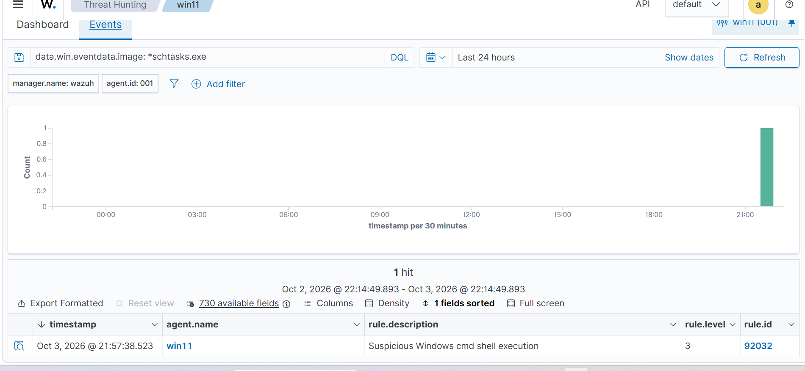

**Correction** : règle [`100100`](../rules/local_rules.xml), de niveau 10 avec le tag MITRE T1053.005. Elle se déclenche quand `schtasks.exe` est lancé avec `/create`, sans tenir compte de la casse (`(?i)`). Sa syntaxe a été validée avec `wazuh-analysisd -t` avant de redémarrer le manager.

**Après** : on rejoue le test. Dans le même tableau, on voit les deux exécutions : celle d'avant la règle (une seule ligne 92032 niveau 3) et celle d'après, où la règle 100100 niveau 10 apparaît **en plus** de la 92032, avec un titre explicite et le poste concerné. La nouvelle règle n'écrase rien, elle ajoute une alerte mieux qualifiée.

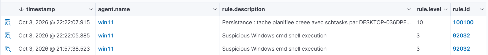

**Pourquoi ne pas simplement monter la 92032 ?** « cmd lance un programme » arrive des centaines de fois par jour : la monter créerait des faux positifs. On ajoute plutôt une règle **plus précise**, donc plus rare, qu'on peut mettre plus haut.

---

## 3. T1547.001 : clé de registre Run

**Test** : Atomic `T1547.001-1`, un `reg add` dans `...\CurrentVersion\Run`.

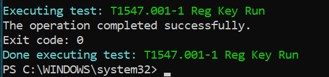

**Alerte Wazuh** : règle 92302, niveau 6, « Registry entry to be executed on next logon was modified using command line application reg.exe ». Elle porte le tag MITRE T1547.001 (Persistence, Privilege Escalation).

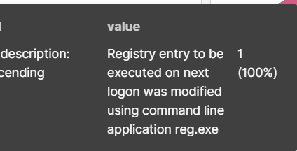
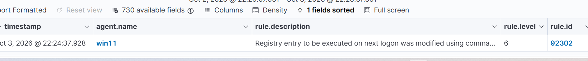
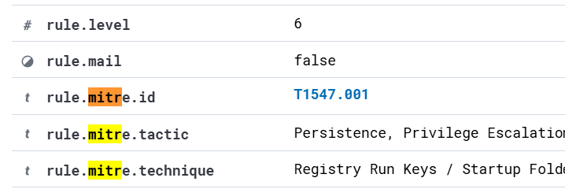

En cliquant sur l'ID MITRE dans Wazuh, on ouvre la fiche de la technique : sa description, et ici les chemins de registre et dossiers de démarrage que les attaquants utilisent.

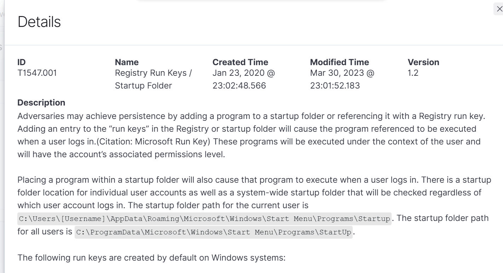

**Verdict** : détecté et bien qualifié nativement. Pas besoin de règle perso : on ne complète que là où la détection native est insuffisante.

---

## 4. T1003.001 : dump de la mémoire de LSASS (trou de collecte)

**Test** : parmi les 14 variantes Atomic de T1003.001 (ProcDump, Mimikatz, NanoDump…), on a choisi la n°2, qui n'a besoin d'aucun outil externe.

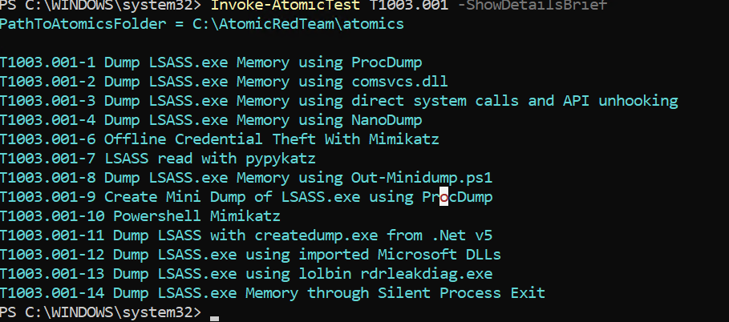

Atomic `T1003.001-2`, qui lance `rundll32.exe comsvcs.dll, MiniDump <PID lsass> lsass.dmp full`. Il s'agit d'un LOLBin : une DLL signée Microsoft détournée.

**Ce qui s'est passé** : « Access is denied ». Defender a bloqué la commande et l'a journalisée dans son propre canal : événement 1116 (`Trojan:Win32/RundllLolBin.AF`, Severe) puis 1117 (action Remove).

**Problème** : rien dans Wazuh. L'agent ne collectait pas le canal `Microsoft-Windows-Windows Defender/Operational`.

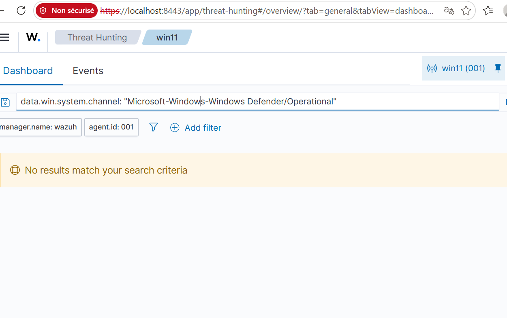

**Correction** : ajout du canal dans `ossec.conf` de l'agent (`<localfile>` en `eventchannel`), puis on rejoue le test.

**Après** : 2 alertes, la détection et l'action, dont une de niveau ≥ 12.

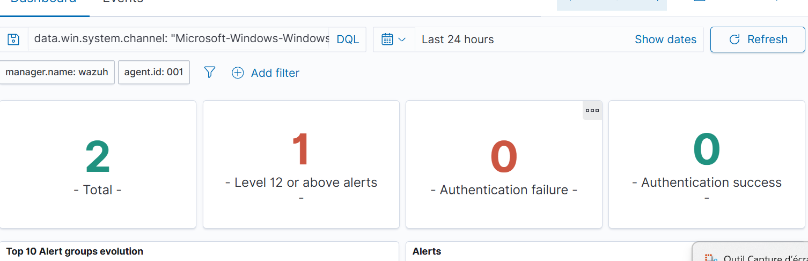
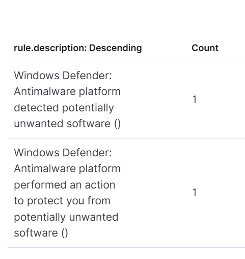

**Leçon** : une prévention doit aussi remonter au SOC. Une tentative bloquée veut dire qu'un attaquant est déjà sur le poste.
**Limites restantes** : la description Wazuh n'affiche pas le nom de la menace (« () »), et la config SwiftOnSecurity ne journalise pas l'event Sysmon 10 (accès à LSASS).

---

## 5. T1070.001 : effacement des journaux

**Test** : `wevtutil cl Security`, lancé à la main parce que le fichier YAML Atomic manquait dans le téléchargement.

**Alerte Wazuh** : « The audit log was cleared » (événement 1102).

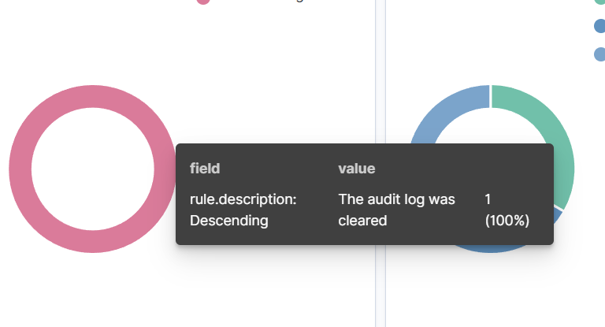

**Leçon** : effacer les journaux sur le poste n'efface pas ce que le SIEM a déjà reçu. C'est une des raisons d'être d'un SIEM : centraliser les logs hors de portée de l'attaquant.

---

## Bonus : qualification d'un faux positif

Wazuh a signalé « Successful Remote Logon… NTLM authentication, possible pass-the-hash attack ». L'enquête montre que l'IP source est 10.10.10.1 (le bastion Proxmox, via le tunnel SSH), que le poste source est le mien, et que l'heure correspond à ma connexion RDP. C'est donc une activité d'administration légitime. En production, on documenterait l'exception ou on ajusterait la règle pour les IP d'administration connues.

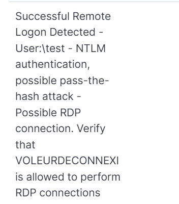
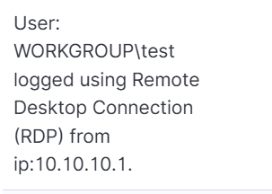

---

## Linux : `ubuntu-cible`

L'agent 002 est actif. Il lance tout seul l'audit SCA CIS Ubuntu 24.04 et lit journald (sshd, sudo).

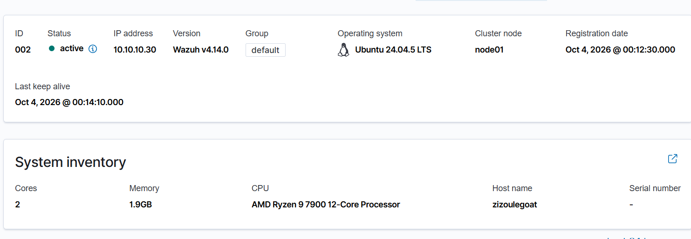

### L1. T1110 : brute force SSH

**Test** : 10 connexions SSH avec des utilisateurs inexistants (`pirate1` à `pirate10`).

**Résultat** : une alerte sshd par tentative. Le panneau MITRE de l'agent affiche Credential Access : 10.

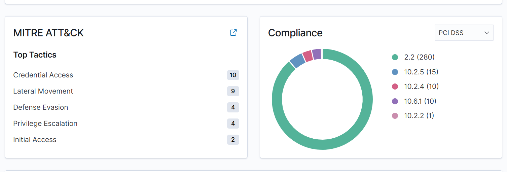

### L2. FIM : création d'un compte vue par le contrôle d'intégrité

**Configuration** : par défaut, l'agent scanne `/etc` toutes les 12 heures. On le passe en `realtime="yes"` avec `report_changes="yes"`.

**Test** : `useradd -m backdoor`, puis `userdel -r backdoor` pour nettoyer.

**Résultat** : règle 550 « Integrity checksum changed », niveau 7, 12 fois (passwd, shadow, group, gshadow, subuid, subgid et leurs sauvegardes `-`). S'y ajoutent « File added / deleted » pour les fichiers temporaires et les verrous. Chaque alerte donne le fichier, la taille, la date de modification et les hashes avant et après.

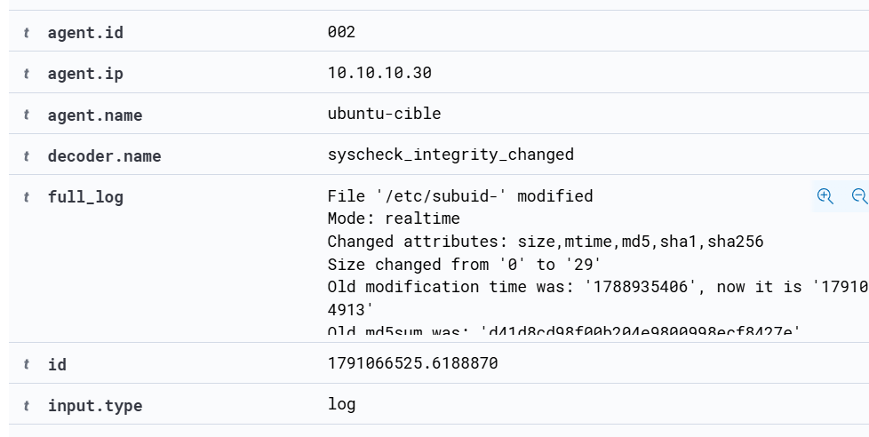
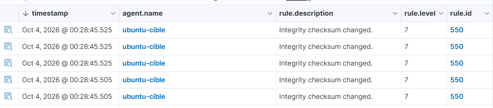
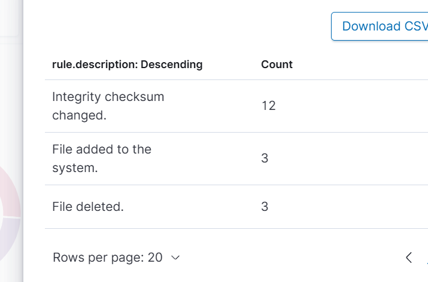

**Choix assumé** : le temps réel est plus réactif, mais il coûte plus de ressources et génère plus de bruit qu'un scan périodique.

---

## Leçons générales

- Mesurer d'abord la détection native, puis compléter seulement là où il y a un trou : soit une détection mal qualifiée (100100), soit une source non collectée (Defender).
- Une recherche vide ne prouve rien : il faut vérifier la casse, les filtres actifs du dashboard, et le fait que Wazuh n'indexe que les événements qui déclenchent une règle.
- Le niveau d'une règle est un compromis entre couverture et bruit. Plus une règle est précise, plus on peut la monter.
